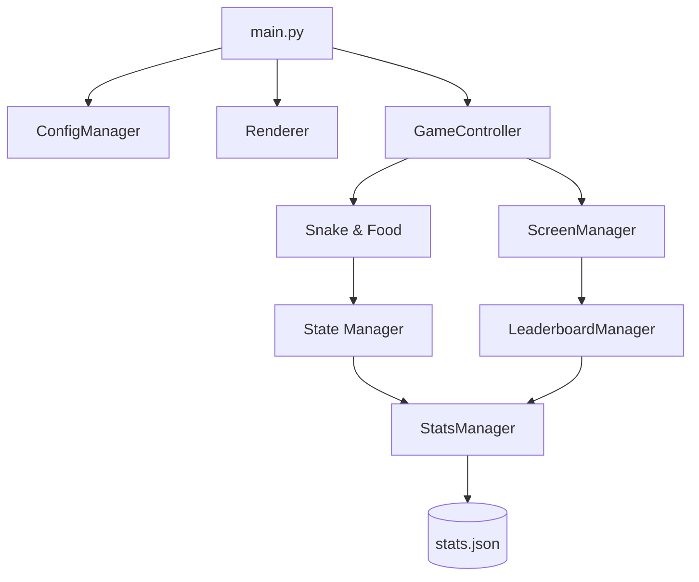

# Architecture & Code Walkthrough

## 📁 Project Structure

```text
snake_cli/
├── main.py                 # Application Entry Point
├── data/                   # Data Management & Persistence
│   ├── config.py           # Settings loader/saver (11+ configurable options)
│   ├── stats.py            # Session statistics logger + history retrieval
│   └── leaderboard.py      # Leaderboard formatting with sorting support
├── game/                   # Core Logic
│   ├── loop.py             # Main Game Controller & execution flow
│   ├── snake.py            # Snake entity with per-segment symbol/color tracking
│   ├── food.py             # Food entity with configurable color & spawn rates
│   ├── state.py            # Session state tracking (includes settings snapshot)
│   └── obstacles.py        # Static obstacle management
├── ui/                     # Presentation Layer
│   ├── renderer.py         # Curses abstraction with 2x horizontal scaling
│   ├── screens.py          # Menu, Pause, End, Leaderboard, and History screens
│   ├── colors.py           # Curses color definitions (7 colors)
│   └── themes.py           # Predefined color schemes (4 themes)
├── tests/                  # Unit tests (pytest)
├── run_snake.bat           # Windows Launcher
└── run_snake.sh            # Unix/macOS Launcher
```

## 🏗️ High-Level Architecture

The project follows a **Modified MVC (Model-View-Controller)** pattern adapted for terminal rendering:

1.  **Models (`game/*.py`, `data/*.py`)**: Encapsulate the state of the snake, food, obstacles, and historical stats.
2.  **View (`ui/*.py`)**: Handles all `curses` interactions, pixel rendering, and screen management.
3.  **Controller (`game/loop.py`)**: Orchestrates the input-update-draw cycle, managing the transitions between game states.

## 核心模块 (Core Modules)

| Module | Purpose | Key Responsibility |
| :--- | :--- | :--- |
| `GameController` | Orchestration | Manages the main game loop, input processing, and frame timing. |
| `Renderer` | Abstraction | Provides a clean API for drawing characters with 2x horizontal scaling. |
| `Snake` | Entity Logic | Tracks body coordinates AND per-segment symbols/colors. |
| `Food` | Entity Logic | Spawns with configurable color (or random) and big food chance. |
| `ConfigManager` | Persistence | Synchronizes in-memory settings with `config.json`. |
| `StatsManager` | Persistence | Appends session summaries, supports multi-sort retrieval. |
| `LeaderboardManager` | Data View | Formats top scores with toggle-able sort (score vs. time). |
| `ScreenManager` | UI Flow | Manages all screens: Start, Pause, End, Leaderboard, History. |

## ⚙️ Configuration Schema

```json
{
  "speed": 10,
  "walls_on": true,
  "obstacles_on": false,
  "theme": "Classic",
  "snake_shape": "█",
  "snake_color": "GREEN",
  "snake_mode": "same_color",
  "food_color": "RANDOM",
  "big_food_chance": 10
}
```

## 🔄 Data Flow



1.  **Input**: `Renderer.get_input()` captures non-blocking keystrokes.
2.  **Update**: `GameController.update()` moves entities and checks for collisions based on captured input.
3.  **Draw**: `Renderer` wipes the screen and draws the updated state (with 2x horizontal scaling for square pixels).
4.  **Save**: On `Game Over`, `StatsManager` persists the `GameState` summary including all settings used.

## 📦 Dependencies

-   **Runtime**: Python 3.10+, `windows-curses` (Windows only).
-   **Development**: `pytest` for running the automated test suite.

## 🏁 Execution Flow

1.  **Entry (`main.py`)**: `curses.wrapper` initializes the terminal and passes control to `main`.
2.  **Initialization**: Managers load configurations and historical stats.
3.  **Menu Loop**: `ScreenManager.show_start_page` captures user settings (11 options).
4.  **Active Loop**: `GameController.start_game` runs until collision or manual quit.
5.  **Termination**: `ScreenManager.show_end_page` displays full stats + settings, collects player name, and triggers logging.
6.  **Post-Game**: Player can view History, restart, or return to menu.

## 🆕 Recent Additions

- **Horizontal Scaling**: Renderer uses `x * 2` for all game coordinates, fixing the vertical-faster-than-horizontal issue.
- **Per-Segment Tracking**: Snake stores `symbols[]` and `segment_colors[]` for each body part.
- **Food Customization**: `food_color` and `big_food_chance` are now menu-configurable.
- **History Screen**: `show_history()` displays all past sessions with pagination.
- **Leaderboard Sorting**: Toggle between score and survival time with `S` key.
